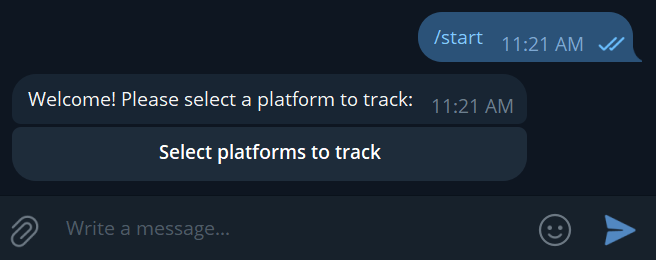

# Reddit Scraper Bot

## Description

**Reddit Scraper Bot** is a Python-based Telegram bot that scrapes Reddit profiles to track user posts and notify you via Telegram when new posts are made. The bot uses web scraping techniques to monitor Reddit profiles by scraping the profile pages directly, without relying on the Reddit API.

## Features

- Tracks specific Reddit users' posts and notifies you of new posts.
- Allows you to add or remove Reddit users from tracking.
- Sends periodic updates to check if new posts are available.
- Supports retry logic in case the bot fails to send messages.
- Easy setup with environment variables for sensitive information.

## Project Structure

Here's an overview of the project structure:

```
RedditScraperBot/
│
├── bot.py                   # Main Telegram bot script
├── helpers/
│   └── latest_posts.py       # Web scraping logic for Reddit
├── screenshots               # Folder containing screenshots for the README.md
├── .env.example              # Example of the .env file for configuration
├── .env                      # Actual .env file (should be created by the user)
├── LICENSE                   # License information for the project
├── README.md                 # Documentation (this file)
├── .gitignore                # Gitignore to exclude sensitive files like .env
└── requirements.txt          # List of required Python libraries
```

## Requirements

To run this project, you will need:

- **Python 3.7 or higher**
- Libraries:
  - `python-telegram-bot==20.3`
  - `python-dotenv==0.20.0`
  - `beautifulsoup4==4.12.3`
  - `requests==2.31.0`

## Installation and Setup

Follow these steps to get the bot up and running:

### 1. Clone the Repository

First, clone the repository to your local machine:

```bash
git clone https://github.com/Glooring/RedditScraperBot.git
cd RedditScraperBot
```

### 2. Install Dependencies

Use the `requirements.txt` file to install the required Python libraries:

```bash
pip install -r requirements.txt
```

This will install the following libraries:
- `python-telegram-bot`: For interacting with the Telegram API.
- `python-dotenv`: To manage environment variables.
- `beautifulsoup4`: For parsing HTML while scraping Reddit.
- `requests`: To handle HTTP requests to Reddit.

### 3. Configure the Environment

#### Create the `.env` File

To keep your sensitive information secure (like the Telegram bot token), you'll use a `.env` file. 

1. Create a file named `.env` in the root directory of the project.
2. Add the following line, replacing `your-telegram-bot-token-here` with your actual bot token from Telegram:

```
TELEGRAM_BOT_TOKEN=your-telegram-bot-token-here
```

#### Example `.env` File

If you are unsure how to format the `.env` file, refer to `.env.example` as a guide:

```
# .env.example
TELEGRAM_BOT_TOKEN=your-telegram-bot-token-here
```
You should rename this file from .env.example to .env before using it.

---

### 4. Run the Bot

Once you’ve set up your environment and installed the necessary libraries, run the bot with:

```bash
python bot.py
```

This will start the bot, and you can begin interacting with it via Telegram.

---

## Usage

### Starting the Bot

1. In your Telegram app, find your bot by searching for its name or using its bot link.
2. Send the `/start` command to the bot to begin interacting.

```bash
/start
```

- **Screenshot Example**:  


The bot will welcome you and provide an option to select a platform to track (Reddit is the current option).

---

### Adding a Reddit User to Track

1. After starting the bot, click on the **"Select platforms to track"** button and choose **Reddit**.

- **Screenshot Example**:  


2. Next, press the **"Add user"** button to begin adding a Reddit profile.

   - **Screenshot Example**:  


3. You will then be prompted to enter a Reddit user profile link in the following format:

   ```
   https://www.reddit.com/user/username/
   ```

   - **Screenshot Example**:  


3. The bot will begin tracking this user and will notify you when the user makes a new post.

---

### Managing Tracked Users

- The bot provides options to toggle the tracking of specific Reddit users.
- You can view all currently tracked users and remove or toggle them via Telegram's inline keyboard interface.

- **Screenshot Example**:  


---

### Notifications

The bot runs in the background and will send you notifications when a tracked Reddit user posts new content. It checks for updates every few seconds and will only notify you of new posts, avoiding duplicates.

- **Screenshot Example (Notification)**:  


- **Screenshot Example (How it looks in the chat)**:  


---

## How It Works

### Web Scraping Logic

The bot uses web scraping (via the `beautifulsoup4` and `requests` libraries) to access and parse the HTML content of Reddit profile pages. Specifically, it scrapes the profile's "submitted posts" section, retrieves the titles and URLs of the latest posts, and then sends this data to you via Telegram.

Here is a simplified version of the web scraping logic located in `helpers/latest_posts.py`:

```python
import requests
from bs4 import BeautifulSoup

def get_latest_posts(user_profile_url):
    headers = {
        'User-Agent': 'Mozilla/5.0 (Windows NT 10.0; Win64; x64) AppleWebKit/537.36 (KHTML, like Gecko) Chrome/91.0.4472.124 Safari/537.36'
    }
    
    response = requests.get(user_profile_url + "submitted/", headers=headers)
    
    if response.status_code == 200:
        soup = BeautifulSoup(response.text, 'html.parser')
        posts = []

        post_links = soup.find_all('a', slot='full-post-link')
        base_url = "https://www.reddit.com"
        
        for link in post_links:
            title_tag = link.find('faceplate-screen-reader-content')
            if title_tag and title_tag.text:
                post_title = title_tag.text
                post_url = base_url + link.get('href')
                posts.append({"title": post_title, "url": post_url})
                break  # Only take the first post

        return posts
    else:
        return f"Failed to retrieve the content. Status code: {response.status_code}"
```

### Telegram Integration

The bot uses the `python-telegram-bot` library to handle commands, messages, and inline keyboard interactions in Telegram. It supports features like:
- `/start` command to initialize the bot.
- Inline keyboard buttons to manage Reddit user tracking.
- Asynchronous message sending with retry logic to handle network failures.

## Notes on Deployment

- **Security**: Ensure that the `.env` file (which contains your Telegram bot token) is not shared publicly or committed to version control. The `.env` file is already included in `.gitignore` to avoid accidental uploads.
- **Scalability**: The bot currently supports tracking multiple Reddit profiles with frequent polling intervals. Depending on usage, you might want to adjust the polling frequency or optimize the scraping process for more extensive usage.

## Contributing

If you'd like to contribute to this project, feel free to fork the repository, make your changes, and submit a pull request. You can also open an issue for discussion.

## License

This project is licensed under the MIT License. See the [LICENSE](LICENSE) file for details.
